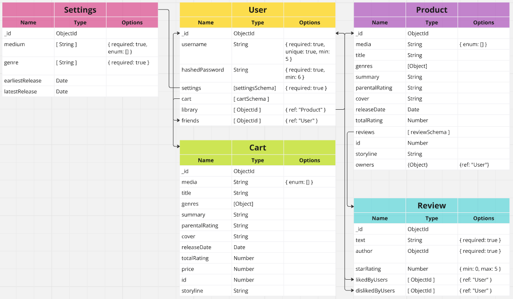

# Media Match App (Back End)
This repository contains the back-end code for **Media Match**, a MERN stack app that helps users build a game library based on their preferences, with future support for other media. It offers a simple interface for discovering new content.  

Developing this app allowed our team to showcase full CRUD capabilitiy while working with both embedded and referenced data. We were also able to implement a third-party API fetch to get product data for our users.

## The Development Team
- Adam Paley: [GitHub](https://github.com/adampaley), [LinkedIn](https://www.linkedin.com/in/adampaley/)
- Ryan Deist: [GitHub](https://github.com/ryandeist), [LinkedIn](https://www.linkedin.com/in/ryantdeist/)
- Matt Hurst: [GitHub](https://github.com/mhurst66), [LinkedIn](https://www.linkedin.com/in/matthew-hurst-85627b56/)

## Overview
- This Express API powers the [Media Match React](https://github.com/adampaley/mern-media-match-front-end) front end for rendering and integrates with the [IGDB API](https://api-docs.igdb.com/#getting-started) for game data.  
- It features basic JWT authorization for protected routes, including validation to prevent incorrect credentials and duplicate accounts.  
- The ERD consists of five schemas, demonstrating one-to-one, one-to-many, and many-to-many relationships.  
- Controller functions are structured to handle CRUD operations for each data type.  
- User data, including settings, cart, and purchases, persist after sign-out.  

[**Deployed App**](https://media-match.netlify.app/)

[**Front-End Repo**](https://github.com/adampaley/mern-media-match-front-end)

[**IGDB API**](https://api-docs.igdb.com/#getting-started)

## ERD Diagrams

## Planning Materials:
- [Trello Board](https://trello.com/b/a6q0CveD/mediamatch)
- [Excalidraw](https://excalidraw.com/#room=e85b8168469433527c79,5qeao3pG57lc7VZd0PgBRg)

## Built with:

## Next Steps:
- Integrate Stripe Purchase Workflow
- Add Books, TV, Music, and Movies to available products.
- Social Network Functionality (Friend Feed, Friend List, Like/Dislike)
- Unit Testing 